Journal of Machine Learning Research 3 (2003) 1137–1155 

Submitted 4/02; Published 2/03 

## **A Neural Probabilistic Language Model** 

**Yoshua Bengio** BENGIOY@IRO.UMONTREAL.CA **Réjean Ducharme** DUCHARME@IRO.UMONTREAL.CA **Pascal Vincent** VINCENTP@IRO.UMONTREAL.CA **Christian Jauvin** JAUVINC@IRO.UMONTREAL.CA _Département d’Informatique et Recherche Opérationnelle Centre de Recherche Mathématiques Université de Montréal, Montréal, Québec, Canada_ 

**Editors:** Jaz Kandola, Thomas Hofmann, Tomaso Poggio and John Shawe-Taylor 

## **Abstract** 

A goal of statistical language modeling is to learn the joint probability function of sequences of words in a language. This is intrinsically difficult because of the **curse of dimensionality** : a word sequence on which the model will be tested is likely to be different from all the word sequences seen during training. Traditional but very successful approaches based on n-grams obtain generalization by concatenating very short overlapping sequences seen in the training set. We propose to fight the curse of dimensionality by **learning a distributed representation for words** which allows each training sentence to inform the model about an exponential number of semantically neighboring sentences. The model learns simultaneously (1) a distributed representation for each word along with (2) the probability function for word sequences, expressed in terms of these representations. Generalization is obtained because a sequence of words that has never been seen before gets high probability if it is made of words that are similar (in the sense of having a nearby representation) to words forming an already seen sentence. Training such large models (with millions of parameters) within a reasonable time is itself a significant challenge. We report on experiments using neural networks for the probability function, showing on two text corpora that the proposed approach significantly improves on state-of-the-art n-gram models, and that the proposed approach allows to take advantage of longer contexts. 

**Keywords:** Statistical language modeling, neural networks, distributed representation, curse of dimensionality 

## **1. Introduction** 

A fundamental problem that makes language modeling and other learning problems _curse of dimensionality_ . It is particularly obvious in the case when one wants to model the joint distribution between many discrete random variables (such as words in a sentence, or discrete attributes in a data-mining task). For example, if one wants to model the joint distribution of 10 consecutive words in a natural language with a vocabulary _V_ of size 100,000, there are potentially 100000[10] _−_ 1 = 10[50] _−_ 1 free parameters. When modeling continuous variables, we obtain generalization more easily (e.g. with smooth classes of functions like multi-layer neural networks or Gaussian mixture models) because the function to be learned can be expected to have some local smoothness properties. For discrete spaces, the generalization structure is not as obvious: any change of these discrete variables may have a drastic impact on the value of the function to be esti- 

_⃝_ c 2003 Yoshua Bengio, Réjean Ducharme, Pascal Vincent, Christian Jauvin. 

BENGIO, DUCHARME, VINCENT AND JAUVIN 

mated, and when the number of values that each discrete variable can take is large, most observed objects are almost maximally far from each other in hamming distance. 

A useful way to visualize how different learning algorithms generalize, inspired from the view of non-parametric density estimation, is to think of how probability mass that is initially concentrated on the training points (e.g., training sentences) is distributed in a larger volume, usually in some form of neighborhood around the training points. In high dimensions, it is crucial to distribute probability mass where it matters rather than uniformly in all directions around each training point. We will show in this paper that the way in which the approach proposed here generalizes is fundamentally different from the way in which previous state-of-the-art statistical language modeling approaches are generalizing. 

A statistical model of language can be represented by the conditional probability of the next word given all the previous ones, since 

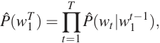

where _wt_ is the _t_ -th word, and writing sub-sequence _wi[j]_[= (] _[w][i][,][w][i]_[+][1] _[,][···][ ,][w][ j][−]_[1] _[,][w][ j]_[)][.][Such][statisti-] cal language models have already been found useful in many technological applications involving natural language, such as speech recognition, language translation, and information retrieval. Improvements in statistical language models could thus have a significant impact on such applications. 

When building statistical models of natural language, one considerably reduces the of this modeling problem by taking advantage of word order, and the fact that temporally closer words in the word sequence are statistically more dependent. Thus, _n-gram_ models construct tables of conditional probabilities for the next word, for each one of a large number of _contexts_ , i.e. combinations of the last _n −_ 1 words: 

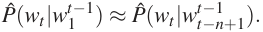

We only consider those combinations of successive words that actually occur in the training corpus, or that occur frequently enough. What happens when a new combination of _n_ words appears that was not seen in the training corpus? We do not want to assign zero probability to such cases, because such new combinations are likely to occur, and they will occur even more frequently for larger context sizes. A simple answer is to look at the probability predicted using a smaller context size, as done in back-off trigram models (Katz, 1987) or in smoothed (or interpolated) trigram models (Jelinek and Mercer, 1980). So, in such models, how is generalization basically obtained from sequences of words seen in the training corpus to new sequences of words? A way to understand how this happens is to think about a generative model corresponding to these interpolated or backoff n-gram models. Essentially, a new sequence of words is generated by “gluing” very short and overlapping pieces of length 1, 2 ... or up to _n_ words that have been seen frequently in the training data. The rules for obtaining the probability of the next piece are implicit in the particulars of the back-off or interpolated n-gram algorithm. Typically researchers have used _n_ = 3, i.e. trigrams, and obtained state-of-the-art results, but see Goodman (2001) for how combining many tricks can yield to substantial improvements. Obviously there is much more information in the sequence that immediately precedes the word to predict than just the identity of the previous couple of words. There are at least two characteristics in this approach which beg to be improved upon, and that we 

1138 

A NEURAL PROBABILISTIC LANGUAGE MODEL 

will focus on in this paper. First, it is not taking into account contexts farther than 1 or 2 words,[1] second it is not taking into account the “similarity” between words. For example, having seen the sentence “ `The cat is walking in the bedroom` ” in the training corpus should help us generalize to make the sentence “ `A dog was running in a room` ” almost as likely, simply because “ `dog` ” and “ `cat` ” (resp. “ `the` ” and “ `a` ”, “ `room` ” and “ `bedroom` ”, etc...) have similar semantic and grammatical roles. 

There are many approaches that have been proposed to address these two issues, and we will briefly explain in Section 1.2 the relations between the approach proposed here and some of these earlier approaches. We will first discuss what is the basic idea of the proposed approach. A more formal presentation will follow in Section 2, using an implementation of these ideas that relies on shared-parameter multi-layer neural networks. Another contribution of this paper concerns the challenge of training such very large neural networks (with millions of parameters) for very large data sets (with millions or tens of millions of examples). Finally, an important contribution of this paper is to show that training such large-scale model is expensive but feasible, scales to large contexts, and yields good comparative results (Section 4). 

Many operations in this paper are in matrix notation, with lower case _v_ denoting a column vector and _v[′]_ its transpose, _A j_ the _j_ -th row of a matrix _A_ , and _x.y_ = _x[′] y_ . 

## **1.1 Fighting the Curse of Dimensionality with Distributed Representations** 

In a nutshell, the idea of the proposed approach can be summarized as follows: 

1. associate with each word in the vocabulary a distributed _word feature vector_ (a realvalued vector in R _[m]_ ), 

2. express the joint _probability function_ of word sequences in terms of the feature vectors of these words in the sequence, and 

3. learn simultaneously the _word feature vectors_ and the parameters of that _probability function_ . 

The feature vector represents different aspects of the word: each word is associated with a point in a vector space. The number of features (e.g. _m_ =30, 60 or 100 in the experiments) is much smaller than the size of the vocabulary (e.g. 17,000). The probability function is expressed as a product of conditional probabilities of the next word given the previous ones, (e.g. using a multilayer neural network to predict the next word given the previous ones, in the experiments). This function has parameters that can be iteratively tuned in order to **maximize the log-likelihood of the training data** or a regularized criterion, e.g. by adding a weight decay penalty.[2] The feature vectors associated with each word are learned, but they could be initialized using prior knowledge of semantic features. 

Why does it work? In the previous example, if we knew that `dog` and `cat` played similar roles (semantically and syntactically), and similarly for ( `the` , `a` ), ( `bedroom` , `room` ), ( `is` , `was` ), 

> 1. n-grams with _n_ up to 5 (i.e. 4 words of context) have been reported, though, but due to data scarcity, most predictions are made with a much shorter context. 

> 2. Like in ridge regression, the squared norm of the parameters is penalized. 

1139 

BENGIO, DUCHARME, VINCENT AND JAUVIN 

( `running` , `walking` ), we could naturally generalize (i.e. transfer probability mass) from `The cat is walking in the bedroom` to `A dog was running in a room` and likewise to `The cat is running in a room A dog is walking in a bedroom The dog was walking in the room ...` 

and many other combinations. In the proposed model, it will so generalize because “similar” words are expected to have a similar feature vector, and because the probability function is a _smooth_ function of these feature values, a small change in the features will induce a small change in the probability. Therefore, the presence of only one of the above sentences in the training data will increase the probability, not only of that sentence, but also of its combinatorial number of “neighbors” in sentence space (as represented by sequences of feature vectors). 

## **1.2 Relation to Previous Work** 

The idea of using neural networks to model high-dimensional discrete distributions has already been found useful to learn the joint probability of _Z_ 1 _··· Zn_ , a set of random variables where each is possibly of a different nature (Bengio and Bengio, 2000a,b). In that model, the joint probability is decomposed as a product of conditional probabilities 

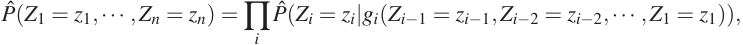

where _g_ ( _._ ) is a function represented by a neural network with a special left-to-right architecture, with the _i_ -th output block _gi_ () computing parameters for expressing the conditional distribution of _Zi_ given the value of the previous _Z_ ’s, in some arbitrary order. Experiments on four UCI data sets show this approach to work comparatively very well (Bengio and Bengio, 2000a,b). Here we must deal with data of variable length, like sentences, so the above approach must be adapted. Another important difference is that here, all the _Zi_ (word at _i_ -th position), refer to the same type of object (a word). The model proposed here therefore introduces a sharing of parameters across time – the same _gi_ is used across time – that is, and across input words at different positions. It is a successful largescale application of the same idea, along with the (old) idea of learning a distributed representation for symbolic data, that was advocated in the early days of connectionism (Hinton, 1986, Elman, 1990). More recently, Hinton’s approach was improved and successfully demonstrated on learning several symbolic relations (Paccanaro and Hinton, 2000). The idea of using neural networks for language modeling is not new either (e.g. Miikkulainen and Dyer, 1991). In contrast, here we push this idea to a **large scale** , and concentrate on learning a **statistical model** of the distribution of word sequences, rather than learning the role of words in a sentence. The approach proposed here is also related to previous proposals of character-based text compression using neural networks to predict the probability of the next character (Schmidhuber, 1996). The idea of using a neural network for language modeling has also been independently proposed by Xu and Rudnicky (2000), although experiments are with networks without hidden units and a single input word, which limit the model to essentially capturing unigram and bigram statistics. 

The idea of discovering some similarities between words to obtain generalization from training sequences to new sequences is not new. For example, it is exploited in approaches that are based on learning a clustering of the words (Brown et al., 1992, Pereira et al., 1993, Niesler et al., 1998, Baker 

1140 

A NEURAL PROBABILISTIC LANGUAGE MODEL 

and McCallum, 1998): each word is associated deterministically or probabilistically with a discrete class, and words in the same class are similar in some respect. In the model proposed here, instead of characterizing the similarity with a discrete random or deterministic variable (which corresponds to a soft or hard partition of the set of words), we use a continuous real-vector for each word, i.e. a **learned distributed feature vector** , to represent similarity between words. The experimental comparisons in this paper include results obtained with class-based n-grams (Brown et al., 1992, Ney and Kneser, 1993, Niesler et al., 1998). 

The idea of using a vector-space representation for words has been well exploited in the area of _information retrieval_ (for example see work by Schutze, 1993), where feature vectors for words are learned on the basis of their probability of co-occurring in the same documents (Latent Semantic Indexing, see Deerwester et al., 1990). An important difference is that here we look for a representation for words that is helpful in representing compactly the probability distribution of word sequences from natural language text. Experiments suggest that learning jointly the representation (word features) and the model is very useful. We tried (unsuccessfully) using as fixed word features for each word _w_ the first principal components of the co-occurrence frequencies of _w_ with the words occurring in text around the occurrence of _w_ . This is similar to what has been done with documents for information retrieval with LSI. The idea of using a continuous representation for words has however been exploited successfully by Bellegarda (1997) in the context of an n-gram based statistical language model, using LSI to dynamically identify the topic of discourse. 

The idea of a vector-space representation for symbols in the context of neural networks has also previously been framed in terms of a parameter sharing layer, (e.g. Riis and Krogh, 1996) for secondary structure prediction, and for text-to-speech mapping (Jensen and Riis, 2000). 

## **2. A Neural Model** 

The training set is a sequence _w_ 1 _··· wT_ of words _wt ∈ V_ , where the vocabulary _V_ is a large but finite set. The objective is to learn a good model _f_ ( _wt , ··· , wt−n_ +1) = _P_[ˆ] ( _wt|w[t]_ 1 _[−]_[1] ), in the sense that it gives high out-of-sample likelihood. Below, we report the geometric average of 1 _/P_[ˆ] ( _wt|w[t]_ 1 _[−]_[1] ), also known as _perplexity_ , which is also the exponential of the average negative log-likelihood. The _|V |_ only constraint on the model is that for any choice of _w[t]_ 1 _[−]_[1] , ∑ _i_ =1 _[f]_[(] _[i][,][w][t][−]_[1] _[,][···][ ,][w][t][−][n]_[+][1][) =][ 1,][with] _f >_ 0. By the product of these conditional probabilities, one obtains a model of the joint probability of sequences of words. We decompose the function _f_ ( _wt , ··· , wt−n_ +1) = _P_[ˆ] ( _wt|w[t]_ 1 _[−]_[1] ) in two parts: 

1. A mapping _C_ from any element _i_ of _V_ to a real vector _C_ ( _i_ ) _∈_ R _[m]_ . It represents the _distributed feature vectors_ associated with each word in the vocabulary. In practice, _C_ is represented by a _|V |× m_ matrix of free parameters. 

2. The probability function over words, expressed with _C_ : a function _g_ maps an input sequence of feature vectors for words in context, ( _C_ ( _wt−n_ +1) _, ··· ,C_ ( _wt−_ 1)), to a conditional probability distribution over words in _V_ for the next word _wt_ . The output of _g_ is a vector whose _i_ -th element estimates the probability _P_[ˆ] ( _wt_ = _i|w[t]_ 1 _[−]_[1] ) as in Figure 1. 

_f_ ( _i, wt−_ 1 _, ··· , wt−n_ +1) = _g_ ( _i,C_ ( _wt−_ 1) _, ··· ,C_ ( _wt−n_ +1)) 

The function _f_ is a composition of these two mappings ( _C_ and _g_ ), with _C_ being _shared_ across all the words in the context. With each of these two parts are associated some parameters. The 

1141 

BENGIO, DUCHARME, VINCENT AND JAUVIN 

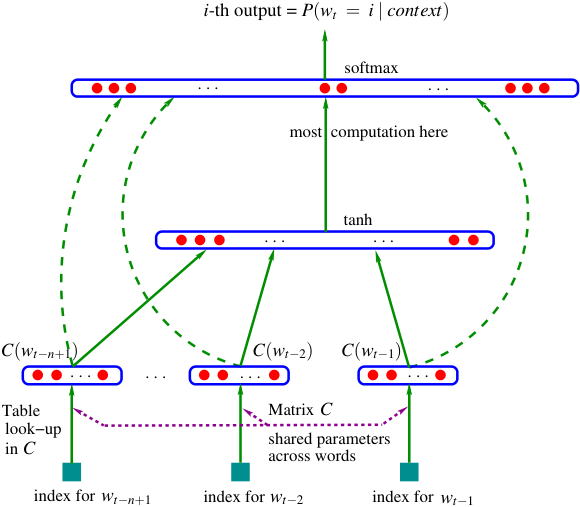

**----- Start of picture text -----** 
i -th output =  P ( wt = i | context ) softmax . . . . . . most  computation here tanh . . . . . . C ( wt−n +1) C ( wt− 2) C ( wt− 1) . . . . . . . . . . . . Table Matrix C look−up in C shared parameters across words index for wt−n +1 index for wt− 2 index for wt− 1 **----- End of picture text -----** 

Figure 1: Neural architecture: _f_ ( _i, wt−_ 1 _, ··· , wt−n_ +1) = _g_ ( _i,C_ ( _wt−_ 1) _, ··· ,C_ ( _wt−n_ +1)) where _g_ is the neural network and _C_ ( _i_ ) is the _i_ -th word feature vector. 

parameters of the mapping _C_ are simply the feature vectors themselves, represented by a _|V | × m_ matrix _C_ whose row _i_ is the feature vector _C_ ( _i_ ) for word _i_ . The function _g_ may be implemented by a feed-forward or recurrent neural network or another parametrized function, with parameters ω . The overall parameter set is θ = ( _C,_ ω ). 

Training is achieved by looking for θ that maximizes the training corpus penalized log-likelihood: 

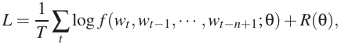

where _R_ ( θ ) is a regularization term. For example, in our experiments, _R_ is a weight decay penalty applied only to the weights of the neural network and to the _C_ matrix, not to the biases.[3] 

In the above model, the number of free parameters **only scales linearly** with _V_ , the number of words in the vocabulary. It also **only scales linearly** with the order _n_ : the scaling factor could be reduced to sub-linear if more sharing structure were introduced, e.g. using a time-delay neural network or a recurrent neural network (or a combination of both). 

In most experiments below, the neural network has one hidden layer beyond the word features mapping, and optionally, direct connections from the word features to the output. Therefore there are really two hidden layers: the shared word features layer _C_ , which has no non-linearity (it would not add anything useful), and the ordinary hyperbolic tangent hidden layer. More precisely, the neural network computes the following function, with a _softmax_ output layer, which guarantees positive probabilities summing to 1: 

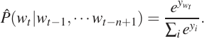

> 3. The _biases_ are the additive parameters of the neural network, such as _b_ and _d_ in equation 1 below. 

1142 

A NEURAL PROBABILISTIC LANGUAGE MODEL 

The _yi_ are the unnormalized log-probabilities for each output word _i_ , computed as follows, with parameters _b_ , _W_ , _U_ , _d_ and _H_ : 

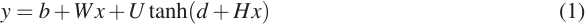

where the hyperbolic tangent tanh is applied element by element, _W_ is optionally zero (no direct connections), and _x_ is the word features layer activation vector, which is the concatenation of the input word features from the matrix C: 

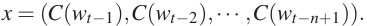

Let _h_ be the number of hidden units, and _m_ the number of features associated with each word. When no direct connections from word features to outputs are desired, the matrix _W_ is set to 0. The free parameters of the model are the output biases _b_ (with _|V |_ elements), the hidden layer biases _d_ (with _h_ elements), the hidden-to-output weights _U_ (a _|V |× h_ matrix), the word features to output weights _W_ (a _|V | ×_ ( _n −_ 1) _m_ matrix), the hidden layer weights _H_ (a _h ×_ ( _n −_ 1) _m_ matrix), and the word features _C_ (a _|V |× m_ matrix): 

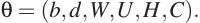

The number of free parameters is _|V |_ (1 + _nm_ + _h_ ) + _h_ (1 + ( _n −_ 1) _m_ ). The dominating factor is _|V |_ ( _nm_ + _h_ ). Note that in theory, if there is a weight decay on the weights _W_ and _H_ but not on _C_ , then _W_ and _H_ could converge towards zero while _C_ would blow up. In practice we did not observe such behavior when training with stochastic gradient ascent. 

Stochastic gradient ascent on the neural network consists in performing the following iterative update after presenting the _t_ -th word of the training corpus: 

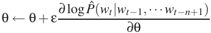

where ε is the “learning rate”. Note that a large fraction of the parameters needs not be updated or visited after each example: the word features _C_ ( _j_ ) of all words _j_ that do not occur in the input window. 

**Mixture of models.** In our experiments (see Section 4) we have found improved performance by combining the probability predictions of the neural network with those of an interpolated trigram model, either with a simple fixed weight of 0.5, a learned weight (maximum likelihood on the validation set) or a set of weights that are conditional on the frequency of the context (using the same procedure that combines trigram, bigram, and unigram in the interpolated trigram, which is a mixture). 

## **3. Parallel Implementation** 

Although the number of parameters scales nicely, i.e. linearly with the size of the input window and linearly with the size of the vocabulary, the amount of computation required for obtaining the output probabilities is much greater than that required from n-gram models. The main reason is that with n-gram models, obtaining a particular _P_ ( _wt|wt−_ 1 _,..., wt−n_ +1) does not require the computation of the probabilities for all the words in the vocabulary, because of the easy normalization (performed when training the model) enjoyed by the linear combinations of relative frequencies. The main computational bottleneck with the neural implementation is the computation of the activations of the output layer. 

1143 

BENGIO, DUCHARME, VINCENT AND JAUVIN 

Running the model (both training and testing) on a parallel computer is a way to reduce computation time. We have explored parallelization on two types of platforms: shared-memory processor machines and Linux clusters with a fast network. 

## **3.1 Data-Parallel Processing** 

In the case of a shared-memory processor, parallelization is easily achieved, thanks to the very low communication overhead between processors, through the shared memory. In that case we have chosen a data-parallel implementation in which **each processor works on a different subset of the data** . Each processor computes the gradient for its examples, and performs stochastic gradient updates on the parameters of the model, which are simply stored in a shared-memory area. Our first implementation was extremely slow and relied on synchronization commands to make sure that each processor would not write at the same time as another one in one of the above parameter subsets. Most of the cycles of each processor were spent waiting for another processor to release a lock on the write access to the parameters. 

Instead we have chosen an **asynchronous implementation** where each processor can write at any time in the shared-memory area. Sometimes, part of an update on the parameter vector by one of the processors is lost, being overwritten by the update of another processor, and this introduces a bit of noise in the parameter updates. However, this noise seems to be very small and did not apparently slow down training. 

Unfortunately, large shared-memory parallel computers are very expensive and their processor speed tends to lag behind mainstream CPUs that can be connected in clusters. We have thus been able to obtain much faster training on fast network clusters. 

## **3.2 Parameter-Parallel Processing** 

If the parallel computer is a network of CPUs, we generally can’t afford to frequently exchange all the parameters among the processors, because that represents tens of megabytes (almost 100 megabytes in the case of our largest network), which would take too much time through a local network. Instead we have chosen to **parallelize across the parameters** , in particular the parameters of the output units, because that is where the vast majority of the computation is taking place, in our architecture. Each CPU is responsible for the computation of the unnormalized probability for a subset of the outputs, and performs the updates for the corresponding output unit parameters (weights going into that unit). This strategy allowed us to perform a **parallelized stochastic gradient ascent** with a negligible communication overhead. The CPUs essentially need to communicate two informations: (1) the normalization factor of the output softmax, and (2) the gradients on the hidden layer (denoted _a_ below) and word feature layer (denoted _x_ ). All the CPUs duplicate the computations that precede the computation of the output units activations, i.e., the selection of word features and the computation of the hidden layer activation _a_ , as well as the corresponding back-propagation and update steps. However, these computations are a negligible part of the total computation for our networks. 

For example, consider the following architecture used in the experiments on the AP (Associated Press) news data: the vocabulary size is _|V |_ = 17 _,_ 964, the number of hidden units is _h_ = 60, the order of the model is _n_ = 6, the number of word features is _m_ = 100. The total number of numerical operations to process a single training example is approximately _|V |_ (1+ _nm_ + _h_ )+ _h_ (1+ _nm_ )+ _nm_ (where the terms correspond respectively to the computations of the output units, hidden units, and word 

1144 

A NEURAL PROBABILISTIC LANGUAGE MODEL 

feature units). In this example the fraction of the overall computation required for computing the _|V |_ (1+( _n−_ 1) _m_ + _h_ ) weighted sums of the output units is therefore approximately _|V |_ (1+( _n−_ 1) _m_ + _h_ )+ _h_ (1+( _n−_ 1) _m_ )+( _n−_ 1) _m_[=] 99 _._ 7%. This calculation is approximate because the actual CPU time associated with different operations differ, but it shows that it is generally advantageous to parallelize the output units computation. The fact that all CPUs will duplicate a very small fraction of the computations is not going to hurt the total computation time for the level of parallelization sought here, i.e. of a few dozen processors. If the number of hidden units was large, parallelizing their computation would also become profitable, but we did not investigate that approach in our experiments. 

The implementation of this strategy was done on a cluster of 1.2 GHz clock-speed Athlon processors (32 x 2 CPUs) connected through a Myrinet network (a low-latency Gigabit local area network), using the MPI (Message Passing Interface) library (Dongarra et al., 1995) for the parallelization routines. The parallelization algorithm is sketched below, for a single example ( _wt−n_ +1 _, ··· , wt_ ), executed in parallel by CPU _i_ in a cluster of _M_ processors. CPU _i_ ( _i_ ranging from 0 to _M −_ 1) is responsible of a block of output units starting at number _starti_ = _i × ⌈|V |/M⌉_ , the block being of length min( _⌈|V |/M⌉, |V |− starti_ ). 

## **COMPUTATION FOR PROCESSOR** _i_ , example _t_ 

## 1. **FORWARD PHASE** 

- (a) Perform forward computation for the word features layer: 

   - _x_ ( _k_ ) _← C_ ( _wt−k_ ), 

   - _x_ = ( _x_ (1) _, x_ (2) _, ··· , x_ ( _n −_ 1)) 

- (b) Perform forward computation for the hidden layer: 

   - _← d_ + _Hx_ 

   - _a ←_ tanh( _o_ ) 

- (c) Perform forward computation for output units in the _i_ -th block: _si ←_ 0 Loop over _j_ in the _i_ -th block 

   - i. _y j ← b j_ + _a.U j_ 

   - ii. If (direct connections) _y j ← y j_ + _x.Wj_ 

   - iii. _p j ← e[y][j]_ 

   - iv. _si ← si_ + _p j_ 

- (d) Compute and share _S_ = ∑ _i si_ among the processors. This can easily be achieved with an MPI `Allreduce` operation, which can efficiently compute and share this sum. 

- (e) Normalize the probabilities: 

   - Loop over _j_ in the _i_ -th block, _p j ← p j/S_ . 

- (f) Update the log-likelihood. If _wt_ falls in the block of CPU _i >_ 0, then CPU _i_ sends _pwt_ to CPU 0. CPU 0 computes _L_ = log _pwt_ and keeps track of the total log-likelihood. 

## 2. **BACKWARD/UPDATE PHASE** , with learning rate ε . 

- (a) Perform backward gradient computation for output units in the _i_ -th block: clear gradient vectors[∂] ∂ _[L] a_[and][∂] ∂ _[L] x_[.] Loop over _j_ in the _i_ -th block 

1145 

BENGIO, DUCHARME, VINCENT AND JAUVIN 

i. ∂∂ _yLj[←]_[1] _[j]_[==] _[w][t][−][p][j]_ 

ii. _b j ← b j_ + ε ∂[∂] _y[L] j_ If (direct connections)[∂] ∂ _[L] x[←]_[∂] ∂ _[L] x_[+] ∂[∂] _y[L] j[W][j]_ ∂ _L_[∂] _[L]_ ∂ _a[←]_[∂] ∂ _[L] a_[+] ∂ _y j[U][j]_ 

If (direct connections) _Wj ← Wj_ + ε ∂[∂] _y[L] j[x] U j ← U j_ + ε ∂[∂] _y[L] j[a]_ 

- (b) Sum and share[∂] ∂ _[L] x_[and][∂] ∂ _[L] a_[across][processors.][This can easily][be achieved][with an][MPI] `Allreduce` operation. 

- (c) Back-propagate through and update hidden layer weights: Loop over _k_ between 1 and _h_ , 

∂ _L_[∂] _[L]_ ∂ _ok[←]_[(][1] _[−][a] k_[2][)] ∂ _ak_ ∂ _L_ ∂ _x[←]_[∂] ∂ _[L] x_[+] _[H][′]_[ ∂] ∂ _[L] o d ← d_ + ε[∂] _[L]_ ∂ _o H ← H_ + ε[∂] _[L]_ ∂ _o[x][′]_ 

- (d) Update word feature vectors for the input words: 

Loop over _k_ between 1 and _n −_ 1 _C_ ( _wt−k_ ) _← C_ ( _wt−k_ )+ ε ∂ _x_[∂] ( _[L] k_ ) where ∂ _x_ ∂ ( _Lk_ )[is the] _[ k]_[-th block (of length] _[ m]_[) of the vector][∂] ∂ _[L] x_[.] 

The weight decay regularization was not shown in the above implementation but can easily be put in (by subtracting the weight decay factor times the learning rate times the value of the parameter, from each parameter, at each update). Note that parameter updates are done directly rather than through a parameter gradient vector, to increase speed, a limiting factor in computation speed being the access to memory, in our experiments. 

There could be a numerical problem in the computation of the exponentials in the forward phase, whereby all the _p j_ could be numerically zero, or one of them could be too large for computing the exponential (step 1(c) _ii_ above). To avoid this problem, the usual solution is to subtract the maximum of the _y j_ ’s before taking the exponentials in the _softmax_ . Thus we have added an extra `Allreduce` operation to share among the _M_ processors the maximum of the _y j_ ’s, before computing the exponentials in _p j_ . Let _qi_ be the maximum of the _y j_ ’s in block _i_ . Then the overall maximum _Q_ = max _i qi_ is collectively computed and shared among the _M_ processors. The exponentials are then computed as follows: _p j ← e[y][j][−][Q]_ (instead of step 1(c) _ii_ ) to guarantee that at least one of the _p j_ ’s will be numerically non-zero, and the maximum of the exponential’s argument is 1. 

By comparing clock time of the parallel version with clock time on a single processor, we found that the communication overhead was only 1/15th of the total time (for one training epoch): thus we get an almost perfect speed-up through parallelization, using this algorithm on a fast network. 

On clusters with a slow network, it might be possible to still obtain parallelization by performing the communications every _K_ examples (a _mini-batch_ ) rather than for each example. This requires storing _K_ versions of the activities and gradients of the neural network in each processor. After the forward phase on the _K_ examples, the probability sums must be shared among the 

1146 

A NEURAL PROBABILISTIC LANGUAGE MODEL 

processors. Then the _K_ backward phases are initiated, to obtain the _K_ partial gradient vectors[∂] ∂ _[L] a_ and[∂] _[L]_ ∂ _x_[. After exchanging these gradient vectors among the processors, each processor can complete] the backward phase and update parameters. This method mainly saves time because of the savings in network communication latency (the amount of data transferred is the same). It may lose in convergence time if _K_ is too large, for the same reason that batch gradient descent is generally much slower than stochastic gradient descent (LeCun et al., 1998). 

## **4. Experimental Results** 

Comparative experiments were performed on the Brown corpus which is a stream of 1,181,041 words, from a large variety of English texts and books. The first 800,000 words were used for training, the following 200,000 for validation (model selection, weight decay, early stopping) and the remaining 181,041 for testing. The number of different words is 47 _,_ 578 (including punctuation, distinguishing between upper and lower case, and including the syntactical marks used to separate texts and paragraphs). Rare words with frequency _≤_ 3 were merged into a single symbol, reducing the vocabulary size to _|V |_ = 16 _,_ 383. 

An experiment was also run on text from the Associated Press (AP) News from 1995 and 1996. The training set is a stream of about 14 million (13,994,528) words, the validation set is a stream of about 1 million (963,138) words, and the test set is also a stream of about 1 million (963,071) words. The original data has 148,721 different words (including punctuation), which was reduced to _|V |_ = 17964 by keeping only the most frequent words (and keeping punctuation), mapping upper case to lower case, mapping numeric forms to special symbols, mapping rare words to a special symbol and mapping proper nouns to another special symbol. 

For training the neural networks, the initial learning rate was set to ε _o_ = 10 _[−]_[3] (after a few trials with a tiny data set), and gradually decreased according to the following schedule: ε _t_ = 1+ ε _ort_[where] _t_ represents the number of parameter updates done and _r_ is a decrease factor that was heuristically chosen to be _r_ = 10 _[−]_[8] . 

## **4.1 N-Gram Models** 

trigram model (Jelinek and Mercer, 1980). Let _qt_ = _l_ ( _freq_ ( _wt−_ 1 _, wt−_ 2)) represents the discretized frequency of occurrence of the input context ( _wt−_ 1 _, wt−_ 2).[4] Then the conditional probability estimates have the form of a conditional mixture: 

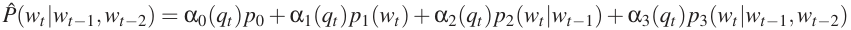

with conditional weights α _i_ ( _qt_ ) _≥_ 0 _,_ ∑ _i_ α _i_ ( _qt_ ) = 1. The base predictors are the following: _p_ 0 = 1 _/|V |_ , _p_ 1( _i_ ) is a unigram (relative frequency of word _i_ in the training set), _p_ 2( _i| j_ ) is the bigram (relative frequency of word _i_ when the previous word is _j_ ), and _p_ 3( _i| j, k_ ) is the trigram (relative frequency of word _i_ when the previous 2 words are _j_ and _k_ ). The motivation is that when the frequency of ( _wt−_ 1 _, wt−_ 2) is large, _p_ 3 is most reliable, whereas when it is lower, the lower-order statistics of _p_ 2, _p_ 1, or even _p_ 0 are more reliable. There is a different set of mixture weights α for each of the discrete values of _qt_ (which are context frequency bins). They can be easily estimated with 

> 4. We used _l_ ( _x_ ) = _⌈−_ log((1 + _x_ ) _/T_ ) _⌉_ where _f req_ ( _wt−_ 1 _, wt−_ 2) is the frequency of occurrence of the input context and _T_ is the size of the training corpus. 

1147 

BENGIO, DUCHARME, VINCENT AND JAUVIN 

the EM algorithm in about 5 iterations, on a set of data (the validation set) not used for estimating the unigram, bigram and trigram relative frequencies. The interpolated n-gram was used to form a mixture with the MLPs since they appear to make “errors” in very different ways. 

Comparisons were also made with other state-of-the-art n-gram models: back-off n-gram models with the _Modified Kneser-Ney_ algorithm (Kneser and Ney, 1995, Chen and Goodman., 1999), as well as class-based n-gram models (Brown et al., 1992, Ney and Kneser, 1993, Niesler et al., 1998). The validation set was used to choose the order of the n-gram and the number of word classes for the class-based models. We used the implementation of these algorithms in the SRI Language Modeling toolkit, described by Stolcke (2002) and in `www.speech.sri.com/projects/srilm/` . They were used for computing the back-off models perplexities reported below, noting that we did not give a special status to end-of-sentence tokens in the accounting of the log-likelihood, just as for our neural network perplexity. All tokens (words and punctuation) were treated the same in averaging the log-likelihood (hence in obtaining the perplexity). 

## **4.2 Results** 

_P_ Below are measures of test set perplexity (geometric average of 1ˆ. Apparent convergence of the stochastic gradient ascent procedure _/P_[ˆ] ( _w_ was obtained _t |w[t]_ 1 _[−]_[1] )) for different modelsafter around 10 to 20 epochs for the Brown corpus. On the AP News corpus we were not able to see signs of overfitting (on the validation set), possibly because we ran only 5 epochs (over 3 weeks using 40 CPUs). Early stopping on the validation set was used, but was necessary only in our Brown experiments. A weight decay penalty of 10 _[−]_[4] was used in the Brown experiments and a weight decay of 10 _[−]_[5] was used in the APNews experiments (selected by a few trials, based on validation set perplexity). Table 1 summarizes the results obtained on the Brown corpus. All the back-off models of the table are modified Kneser-Ney n-grams, which worked significantly better than standard back-off models. When _m_ is specified for a back-off model in the table, a class-based n-gram is used ( _m_ is the number of word classes). Random initialization of the word features was done (similarly to initialization of neural network weights), but we suspect that better results might be obtained with a knowledge-based initialization. 

The **main result** is that better results can be obtained when using the neural network, in comparison with the best of the n-grams, with a test perplexity difference of about 24% on Brown and about 8% on AP News, when taking the MLP versus the n-gram that worked best on the validation set. The table also suggests that the neural network was able to take advantage of more context (on Brown, going from 2 words of context to 4 words brought improvements to the neural network, not to the n-grams). It also shows that the hidden units are useful (MLP3 vs MLP1 and MLP4 vs MLP2), and that mixing the output probabilities of the neural network with the interpolated trigram always helps to reduce perplexity. The fact that simple averaging helps suggests that the neural network and the trigram make errors (i.e. low probability given to an observed word) in different places. The results do not allow to say whether the direct connections from input to output are useful or not, but suggest that on a smaller corpus at least, better generalization can be obtained without the direct input-to-output connections, at the cost of longer training: without direct connections the network took twice as much time to converge (20 epochs instead of 10), albeit to a slightly lower perplexity. A reasonable interpretation is that direct input-to-output connections provide a bit more capacity and faster learning of the “linear” part of the mapping from word features to log- 

1148 

A NEURAL PROBABILISTIC LANGUAGE MODEL 

||n|c|h|m|direct|mix|train.|valid.|test.|
|---|---|---|---|---|---|---|---|---|---|
|MLP1|5||50|60|yes|no|182|284|268|
|MLP2|5||50|60|yes|yes||275|257|
|MLP3|5||0|60|yes|no|201|327|310|
|MLP4|5||0|60|yes|yes||286|272|
|MLP5|5||50|30|yes|no|209|296|279|
|MLP6|5||50|30|yes|yes||273|259|
|MLP7|3||50|30|yes|no|210|309|293|
|MLP8|3||50|30|yes|yes||284|270|
|MLP9|5||100|30|no|no|175|280|276|
|MLP10|5||100|30|no|yes||265|**252**|
|Del. Int.|3||||||31|352|336|
|Kneser-Ney back-off|3|||||||334|323|
|Kneser-Ney back-off|4|||||||332|321|
|Kneser-Ney back-off|5|||||||332|321|
|class-based back-off|3|150||||||348|334|
|class-based back-off|3|200||||||354|340|
|class-based back-off|3|500||||||326|**312**|
|class-based back-off|3|1000||||||335|319|
|class-based back-off|3|2000||||||343|326|
|class-based back-off|4|500||||||327|312|
|class-based back-off|5|500||||||327|312|

- Table 1: Comparative results on the Brown corpus. The deleted interpolation trigram has a test perplexity that is 33% above that of the neural network with the lowest validation perplexity. The difference is 24% in the case of the best n-gram (a class-based model with 500 word classes). _n_ : order of the model. _c_ : number of word classes in class-based n-grams. _h_ : number of hidden units. _m_ : number of word features for MLPs, number of classes for class-based n-grams. _direct_ : whether there are direct connections from word features to outputs. _mix_ : whether the output probabilities of the neural network are mixed with the output of the trigram (with a weight of 0.5 on each). The last three columns give perplexity on the training, validation and test sets. 

probabilities. On the other hand, without those connections the hidden units form a tight bottleneck which might force better generalization. 

Table 2 gives similar results on the larger corpus (AP News), albeit with a smaller difference in perplexity (8%). Only 5 epochs were performed (in approximately three weeks with 40 CPUs). The class-based model did not appear to help the n-gram models in this case, but the high-order modified Kneser-Ney back-off model gave the best results among the n-gram models. 

## **5. Extensions and Future Work** 

In this section, we describe extensions to the model described above, and directions for future work. 

1149 

BENGIO, DUCHARME, VINCENT AND JAUVIN 

||n|h|m|direct|mix|train.|valid.|test.|
|---|---|---|---|---|---|---|---|---|
|MLP10|6|60|100|yes|yes||104|**109**|
|Del. Int.|3||||||126|132|
|Back-off KN|3||||||121|127|
|Back-off KN|4||||||113|119|
|Back-off KN|5||||||112|**117**|

Table 2: Comparative results on the AP News corpus. See the previous table for the column labels. 

## **5.1 An Energy Minimization Network** 

A variant of the above neural network can be interpreted as an energy minimization model following Hinton’s recent work on products of experts (Hinton, 2000). In the neural network described in the previous sections the distributed word features are used only for the “input” words and not for the “output” word (next word). Furthermore, a very large number of parameters (the majority) are expanded in the output layer: the semantic or syntactic similarities between output words are not exploited. In the variant described here, the output word is also represented by its feature vector. The network takes in input a sub-sequence of words (mapped to their feature vectors) and outputs an energy function _E_ which is low when the words form a likely sub-sequence, high when it is unlikely. For example, the network outputs an “energy” function 

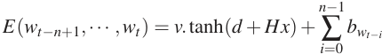

where _b_ is the vector of biases (which correspond to unconditional probabilities), _d_ is the vector of hidden units biases, _v_ is the output weight vector, and _H_ is the hidden layer weight matrix, and unlike in the previous model, input and output words contribute to _x_ : 

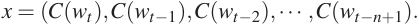

The energy function _E_ ( _wt−n_ +1 _, ··· , wt_ ) can be interpreted as an unnormalized log-probability for the joint occurrence of ( _wt−n_ +1 _, ··· , wt_ ). To obtain a conditional probability _P_[ˆ] ( _wt|w[t] t[−] −_[1] _n_ +1[)][ it is enough] (but costly) to normalize over the possible values of _wt_ , as follows: 

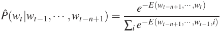

Note that the total amount of computation is comparable to the architecture presented earlier, and the number of parameters can also be matched if the _v_ parameter is indexed by the identity of the target word ( _wt_ ). Note that only _bwt_ remains after the above softmax normalization (any linear function of the _wt−i_ for _i >_ 0 is canceled by the softmax normalization). As before, the parameters of the model can be tuned by stochastic gradient ascent on log _P_[ˆ] ( _wt|wt−_ 1 _, ··· , wt−n_ +1), using similar computations. 

In the products-of-experts framework, the hidden units can be seen as the experts: the joint probability of a sub-sequence ( _wt−n_ +1 _, ··· , wt_ ) is proportional to the exponential of a sum of terms associated with each hidden unit _j_ , _v j_ tanh( _d j_ + _H jx_ ). Note that because we have chosen to decompose the probability of a whole sequence in terms of conditional probabilities for each element, 

1150 

A NEURAL PROBABILISTIC LANGUAGE MODEL 

the computation of the gradient is tractable. This is not the case for example with products-ofHMMs (Brown and Hinton, 2000), in which the product is over experts that view the whole sequence, and which can be trained with approximate gradient algorithms such as the contrastive divergence algorithm (Brown and Hinton, 2000). Note also that this architecture and the productsof-experts formulation can be seen as extensions of the very successful **Maximum Entropy** models (Berger et al., 1996), but where the basis functions (or “features”, here the hidden units activations) are learned by penalized maximum likelihood at the same time as the parameters of the features linear combination, instead of being learned in an outer loop, with greedy feature subset selection methods. 

We have implemented and experimented with the above architecture, and have developed a speed-up technique for the neural network training, based on importance sampling and yielding a 100-fold speed-up (Bengio and Senécal, 2003). 

**Out-of-vocabulary words.** An advantage of this architecture over the previous one is that it can easily deal with out-of-vocabulary words (and even assign them a probability!). The main idea is to first guess an initial feature vector for such a word, by taking a weighted convex combination of the feature vectors of other words that could have occurred in the same context, with weights proportional to their conditional probability. Suppose that the network assigned a probability _P_[ˆ] ( _i|w[t] t[−] −_[1] _n_ +1[)] to words _i ∈ V_ in context _w[t] t[−] −_[1] _n_ +1[, and that in this context we observe a new word] _[j][ ̸∈][V]_[.][We initialize] the feature vector _C_ ( _j_ ) for _j_ as follows: _C_ ( _j_ ) _←_ ∑ _i∈V C_ ( _i_ ) _P_[ˆ] ( _i|w[t] t[−] −_[1] _n_ +1[)][.][We can][then incorporate] _[j]_ in _V_ and re-compute probabilities for this slightly larger set (which only requires a renormalization for all the words, except for word _i_ , which requires a pass through the neural network). This feature vector _C_ ( _i_ ) can then be used in the input context part when we try to predict the probabilities of words that follow word _i_ . 

## **5.2 Other Future Work** 

There are still many challenges ahead to follow-up on this work. In the short term, methods to speed-up training and recognition need to be designed and evaluated. In the longer term, more ways to generalize should be introduced, in addition to the two main ways exploited here. Here are some ideas that we intend to explore: 

1. Decomposing the network in sub-networks, for example using a clustering of the words. Training many smaller networks should be easier and faster. 

2. Representing the conditional probability with a tree structure where a neural network is applied at each node, and each node represents the probability of a word class given the context and the leaves represent the probability of words given the context. This type of representation has the potential to reduce computation time by a factor _|V |/_ log _|V |_ (see Bengio, 2002). 

3. Propagating gradients only from a subset of the output words. It could be the words that are conditionally most likely (based on a faster model such as a trigram, see Schwenk and Gauvain, 2002, for an application of this idea), or it could be a subset of the words for which the trigram has been found to perform poorly. If the language model is coupled to a speech recognizer, then only the scores (unnormalized probabilities) of the acoustically ambiguous words need to be computed. See also Bengio and Senécal (2003) for a new accelerated training method using importance sampling to select the words. 

1151 

BENGIO, DUCHARME, VINCENT AND JAUVIN 

4. Introducing a-priori knowledge. Several forms of such knowledge could be introduced, such as: semantic information (e.g., from WordNet, see Fellbaum, 1998), low-level grammatical information (e.g., using parts-of-speech), and high-level grammatical information, e.g., coupling the model to a stochastic grammar, as suggested in Bengio (2002). The effect of longer term context could be captured by introducing more structure and parameter sharing in the neural network, e.g. using time-delay or recurrent neural networks. In such a multi-layered network the computation that has been performed for small groups of consecutive words does not need to be redone when the network input window is shifted. Similarly, one could use a recurrent network to capture potentially even longer term information about the subject of the text. 

5. Interpreting (and possibly using) the word feature representation learned by the neural network. A simple first step would start with _m_ = 2 features, which can be more easily displayed. We believe that more meaningful representations will require large training corpora, especially for larger values of _m_ . 

6. Polysemous words are probably not well served by the model presented here, which assigns to each word a single point in a continuous semantic space. We are investigating extensions of this model in which each word is associated with multiple points in that space, each associated with the different senses of the word. 

## **6. Conclusion** 

The experiments on two corpora, one with more than a million examples, and a larger one with above 15 million words, have shown that the proposed approach yields much better perplexity than a state-of-the-art method, the smoothed trigram, with differences between 10 and 20% in perplexity. 

We believe that the main reason for these improvements is that the proposed approach allows to take advantage of the learned distributed representation to fight the curse of dimensionality with its own weapons: each training sentence informs the model about a combinatorial number of other sentences. 

There is probably much more to be done to improve the model, at the level of architecture, computational efficiency, and taking advantage of prior knowledge. An important priority of future research should be to improve speed-up techniques[5] as well as ways to increase capacity without increasing training time too much (to deal with corpora with hundreds of millions of words or more). A simple idea to take advantage of temporal structure and extend the size of the input window to include possibly a whole paragraph (without increasing too much the number of parameters or computation time) is to use a time-delay and possibly recurrent neural networks. Evaluations of the type of models presented here in applicative contexts would also be useful, but see work already done by Schwenk and Gauvain (2002) for improvements in speech recognition word error rate. 

More generally, the work presented here opens the door to improvements in statistical language models brought by replacing “tables of conditional probabilities” by more compact and smoother representations based on distributed representations that can accommodate far more conditioning variables. Whereas much effort has been spent in statistical language models (e.g. stochastic grammars) to restrict or summarize the conditioning variables in order to avoid overfitting, the type of 

> 5. See work by Bengio and Senécal (2003) for a 100-fold speed-up technique. 

1152 

A NEURAL PROBABILISTIC LANGUAGE MODEL 

models described here shifts the elsewhere: many more computations are required, but computation and memory requirements scale linearly, not exponentially with the number of conditioning variables. 

## ACKNOWLEDGMENTS 

The authors would like to thank Léon Bottou, Yann Le Cun and Geoffrey Hinton for useful discussions. This research was made possible by funding from the NSERC granting agency, as well as the MITACS and IRIS networks. 

## **References** 

- D. Baker and A. McCallum. Distributional In _SIGIR’98_ , 1998. 

- J.R. Bellegarda. A latent semantic analysis framework for large–span language modeling. In _Proceedings of Eurospeech 97_ , pages 1451–1454, Rhodes, Greece, 1997. 

- S. Bengio and Y. Bengio. Taking on the curse of dimensionality in joint distributions using neural networks. _IEEE Transactions on Neural Networks, special issue on Data Mining and Knowledge Discovery_ , 11(3):550–557, 2000a. 

- Y. Bengio. New distributed probabilistic language models. Technical Report 1215, Dept. IRO, Université de Montréal, 2002. 

- Y. Bengio and S. Bengio. Modeling high-dimensional discrete data with multi-layer neural networks. In S. A. Solla, T. K. Leen, and K-R. Müller, editors, _Advances in Neural Information Processing Systems_ , volume 12, pages 400–406. MIT Press, 2000b. 

- Y. Bengio and J-S. Senécal. Quick training of probabilistic neural nets by importance sampling. In _AISTATS_ , 2003. 

- A. Berger, S. Della Pietra, and V. Della Pietra. A maximum entropy approach to natural language processing. _Computational Linguistics_ , 22:39–71, 1996. 

- A. Brown and G.E. Hinton. Products of hidden markov models. Technical Report GCNU TR 2000-004, Gatsby Unit, University College London, 2000. 

- P.F. Brown, V.J. Della Pietra, P.V. DeSouza, J.C. Lai, and R.L. Mercer. Class-based _n_ -gram models of natural language. _Computational Linguistics_ , 18:467–479, 1992. 

- S.F. Chen and J.T. Goodman. An empirical study of smoothing techniques for language modeling. _Computer, Speech and Language_ , 13(4):359–393, 1999. 

- S. Deerwester, S.T. Dumais, G.W. Furnas, T.K. Landauer, and R. Harshman. Indexing by latent semantic analysis. _Journal of the American Society for Information Science_ , 41(6):391–407, 1990. 

- J. Dongarra, D. Walker, and The Message Passing Interface Forum. MPI: A message passing interface standard. Technical Report http://www-unix.mcs.anl.gov/mpi, University of Tenessee, 1995. 

1153 

BENGIO, DUCHARME, VINCENT AND JAUVIN 

- J.L. Elman. Finding structure in time. _Cognitive Science_ , 14:179–211, 1990. 

- C. Fellbaum. _WordNet: An Electronic Lexical Database_ . MIT Press, 1998. 

- J .Goodman. A bit of progress in language modeling. Technical Report MSR-TR-2001-72, Microsoft Research, 2001. 

- G.E. Hinton. Learning distributed representations of concepts. In _Proceedings of the Eighth Annual Conference of the Cognitive Science Society_ , pages 1–12, Amherst 1986, 1986. Lawrence Erlbaum, Hillsdale. 

- G.E. Hinton. Training products of experts by minimizing contrastive divergence. Technical Report GCNU TR 2000-004, Gatsby Unit, University College London, 2000. 

- F. Jelinek and R. L. Mercer. Interpolated estimation of Markov source parameters from sparse data. In E. S. Gelsema and L. N. Kanal, editors, _Pattern Recognition in Practice_ . North-Holland, Amsterdam, 1980. 

- K.J. Jensen and S. Riis. Self-organizing letter code-book for text-to-phoneme neural network model. In _Proceedings ICSLP_ , 2000. 

- S.M. Katz. Estimation of probabilities from sparse data for the language model component of a speech recognizer. _IEEE Transactions on Acoustics, Speech, and Signal Processing_ , ASSP-35 (3):400–401, March 1987. 

- R. Kneser and H. Ney. Improved backing-off for m-gram language modeling. In _International Conference on Acoustics, Speech and Signal Processing_ , pages 181–184, 1995. 

- Y. LeCun, L. Bottou, G.B. Orr, and K.-R. Müller. In G.B. Orr and K.-R. Müller, editors, _Neural Networks: Tricks of the Trade_ , pages 9–50. Springer, 1998. 

- R. Miikkulainen and M.G. Dyer. Natural language processing with modular neural networks and distributed lexicon. _Cognitive Science_ , 15:343–399, 1991. 

- H. Ney and R. Kneser. Improved clustering techniques for class-based statistical language modelling. In _European Conference on Speech Communication and Technology (Eurospeech)_ , pages 973–976, Berlin, 1993. 

- T.R. Niesler, E.W.D. Whittaker, and P.C. Woodland. Comparison of part-of-speech and automatically derived category-based language models for speech recognition. In _International Conference on Acoustics, Speech and Signal Processing_ , pages 177–180, 1998. 

- A. Paccanaro and G.E. Hinton. Extracting distributed representations of concepts and relations from positive and negative propositions. In _Proceedings of the International Joint Conference on Neural Network, IJCNN’2000_ , Como, Italy, 2000. IEEE, New York. 

- F. Pereira, N. Tishby, and L. Lee. Distributional clustering of english words. In _30th Annual Meeting of the Association for Computational Linguistics_ , pages 183–190, Columbus, Ohio, 1993. 

1154 

A NEURAL PROBABILISTIC LANGUAGE MODEL 

- S. Riis and A. Krogh. Improving protein secondary structure prediction using structured neural networks and multiple sequence profiles. _Journal of Computational Biology_ , pages 163–183, 1996. 

- J. Schmidhuber. Sequential neural text compression. _IEEE Transactions on Neural Networks_ , 7(1): 142–146, 1996. 

- H. Schutze. Word space. In S. J. Hanson, J. D. Cowan, and C. L. Giles, editors, _Advances in Neural Information Processing Systems 5_ , pages pp. 895–902, San Mateo CA, 1993. Morgan Kaufmann. 

- H. Schwenk and J-L. Gauvain. Connectionist language modeling for large vocabulary continuous speech recognition. In _International Conference on Acoustics, Speech and Signal Processing_ , pages 765–768, Orlando, Florida, 2002. 

- A. Stolcke. SRILM - an extensible language modeling toolkit. In _Proceedings of the International Conference on Statistical Language Processing_ , Denver, Colorado, 2002. 

- W. Xu and A. Rudnicky. Can neural network learn language models. In _International Conference on Statistical Language Processing_ , pages M1–13, Beijing, China, 2000. 

1155 

